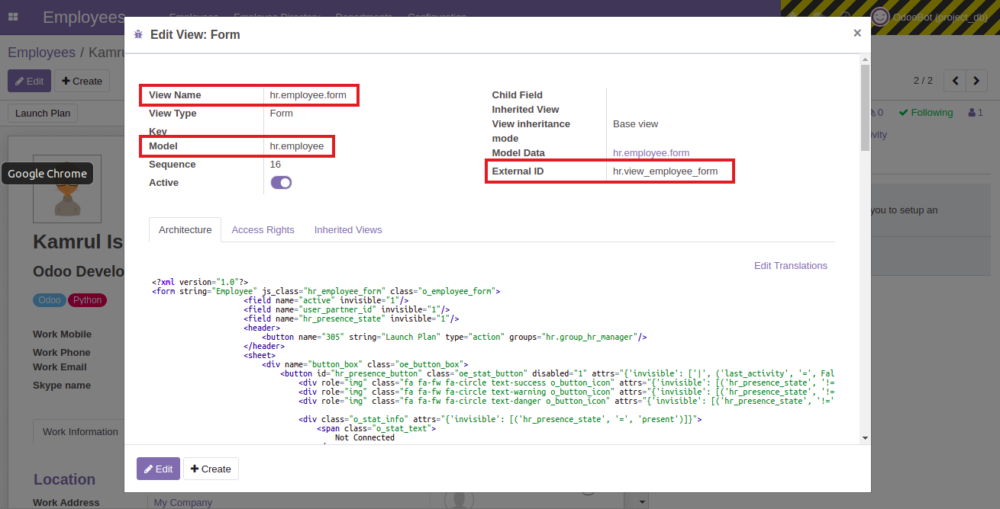
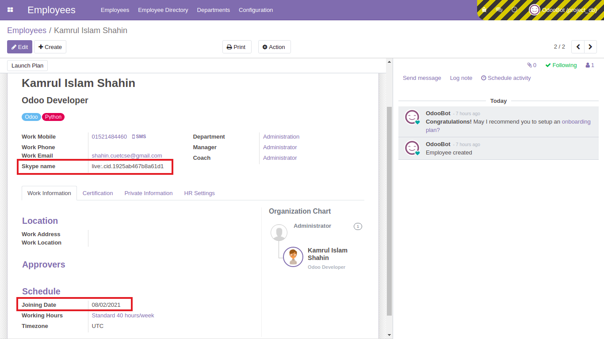
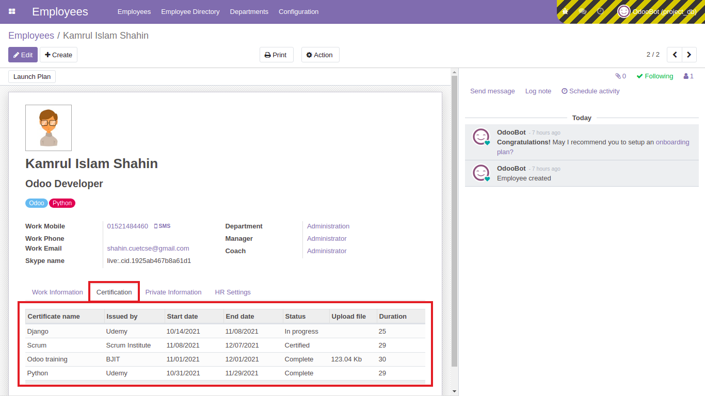

### Inherit employee module and add some fields

- For this we are creating a new module named `employee_custom` for better understanding.
- To inherit an existing table in the `hr.employee` model we have to add module name in `depends` in the manifest file. Here we are inheriting the employee module which name is `hr`.
  ```py
  'depends': ['base', 'hr']
  ```
- Then create a python model to inherit the employee module and add some fields to it. Don't forget to import the python file in `models` > `__init__.py`.

  ```py
  class InheritCertification(models.Model):
      _inherit = "hr.employee"

      skype_name = fields.Char("Skype name")
      joining_date = fields.Date("Joining Date")
  ```

  - [Check out the code](https://github.com/KamrulSh/employee_custom/blob/c22d32fe198d76bb4c47bd641be13eaeb583ce1f/models/certificate.py#L5-L9)

- Then create an `xml` file named `inherit_certificate_views.xml` and copy this code below. Here `name` will be `hr.view_employee_form`, `model` will be `hr.employee` and `inherit_id` > `ref` will be `hr.view_employee_form` as we are inheriting the from view of `hr.employee`.
- Go to `Bug icon > Edit View: Form` to find the required fields.

  

  ```xml
  <record id="employee_inherit_id" model="ir.ui.view">
      <field name="name">hr.view_employee_form</field>
      <field name="model">hr.employee</field>
      <field name="inherit_id" ref="hr.view_employee_form"/>
      <field name="arch" type="xml">
          <xpath expr="//field[@name='work_email']" position="after">
              <field name="skype_name"/>
          </xpath>

          <xpath expr="//field[@name='resource_calendar_id']" position="before">
              <field name="joining_date"/>
          </xpath>
      </field>
  </record>
  ```

  - [Check out the code](https://github.com/KamrulSh/employee_custom/blob/c22d32fe198d76bb4c47bd641be13eaeb583ce1f/views/inherit_certificate_views.xml#L9-L15)

- Add the xml file to the `__manifest__.py`. Install the `employee_custom` module and go to the `hr.employee` model and you will get the added field like below.

  

### Add a new notebook in the employee module

- Now our goal is to create a new notebook in the employee module something like this:

  

- For this we have to create fields based on the requirements. As `certificate_name`, `issued_by` are `Many2one` field we have to create separate new classes to store those information.

  ```py
  class EmployeesCertification(models.Model):
      _name = 'employee.certificate'
      _description = "Employee Certification"

      certificate_name = fields.Many2one('employee.certificate.name', string="Certificate name", required=True)
      issued_by = fields.Many2one('employee.certificate.issued', string="Issued by", required=True)
  ```

  ```py
  class CertificationName(models.Model):
      _name = 'employee.certificate.name'
      _description = "Employee Certification name"

      name = fields.Char(string="Certificate name")


  class CertificationIssued(models.Model):
      _name = 'employee.certificate.issued'
      _description = "Employee Certification Issued"

      name = fields.Char(string="Certificate Issued by")
  ```

- Try to add other fields `start_date`, `end_date` as `Date` field, `status` as `Selection` field and `upload_file` as `Binary` field.

  ```py
  start_date = fields.Date(string="Start date")
  end_date = fields.Date(string="End date")
  date_diff = fields.Char(string="Duration", readonly=True)
  status = fields.Selection([
      ('complete', 'Complete'),
      ('progress', 'In progress'),
      ('certified', 'Certified')
  ], tracking=True, required=True)
  upload_file = fields.Binary(string="Upload file")
  ```

- To add or view all those information in inherited fields, we need to add a `One2many` relationship in the inherited class with corresponding employee having `Many2one` relationship in the parent class.

  ```py
  class InheritCertification(models.Model):
      _inherit = "hr.employee"

      certificate_ids = fields.One2many('employee.certificate', 'employees_id', string="Certificate")
  ```

  ```py
  class EmployeesCertification(models.Model):
      _name = 'employee.certificate'

      employee_id = fields.Many2one('hr.employee', string="Certificate")
  ```

- Finally we have to create an `xpath` in the view file to show the fields in the `employee` module by creating a new notebook.

  ```xml
  <xpath expr="//notebook/page[1]" position="after">
      <page string="Certification">
          <field name="certificate_ids"/>
      </page>
  </xpath>
  ```

  

- This is the final output of the inherited module after creating the new notebook.

  - [Check out the python code](https://github.com/KamrulSh/employee_custom/blob/master/models/certificate.py)
  - [Check out the xml code](https://github.com/KamrulSh/employee_custom/blob/master/views/inherit_certificate_views.xml)

## 🚀 Happy Coding ! 🔥
