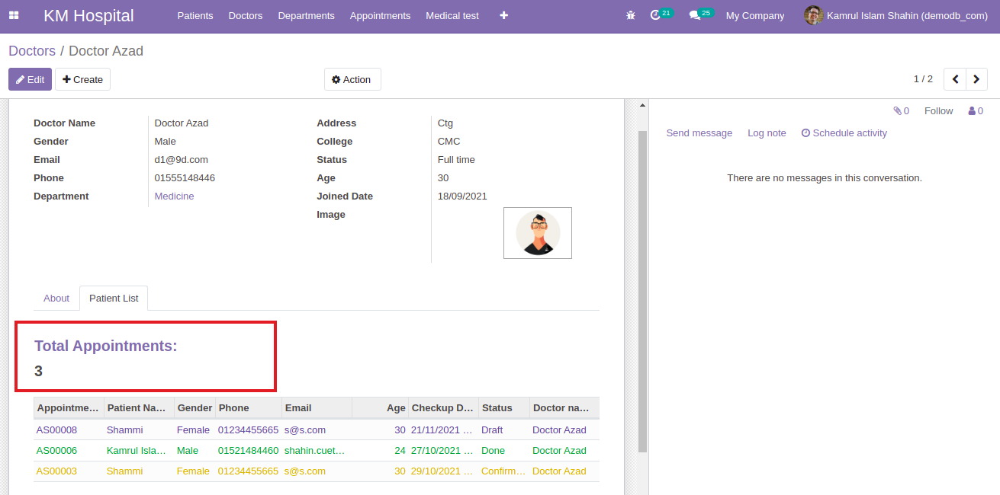

### On change function

- If we choose a patient name while creating a new appointment, it will automatically fill the `Note` field and if we remove the patient it will be empty. This task is done using `onChange` function.

  ```py
  @api.onchange('patient_id')
    def _change_appointment_note(self):
        if self.patient_id:
            if not self.note:
                self.note = "New appointment"
        else:
            self.note = ""
  ```

  

  - [Check out the code for onChange](https://github.com/KamrulSh/km_hospital/commit/6673e3f8f3d9791ad18064dd6cdb37f10336afdb)

- If we set `Note` as a `readonly` field and save it will not store the data of `Note`. To save we have to use `force_save="1"` in the form view of the `Note` field.
  ```xml
  <field name="note" readonly="1" force_save="1"/>
  ```
  - [Check out the code](https://github.com/KamrulSh/km_hospital/blob/ae7e36f3bacd49504659a2e72dd13b61c14335d7/views/appointment_view.xml#L57)

### Computed fields

- To compute the appointment of an individual doctor we have to find in the appointment table based on doctor id. Here `appointed_doctor_id` will come from the appointment model which is a `Many2one` field.

  ```py
  total_appointments = fields.Integer(string='No. of appointments', compute='_compute_appointments')

  # compute appointments of individual doctor
  def _compute_appointments(self):
      for record in self:
          record.total_appointments = self.env['kmhospital.appointment'].search_count(
              [('appointed_doctor_id', '=', record.id)])
  ```

- We have use a for loop in the computed field as `self` contains multiple values otherwise it will arise `Singleton Error`.

- In the view file we have to add the field of `total_appointments` inside the `Patient List` tab.

  ```xml
  <group string="No. of Appointments:">
      <h2>
          <field name="total_appointments"/>
      </h2>
  </group>
  ```

  

  - [Check out the code](https://github.com/KamrulSh/km_hospital/commit/b65503019a92f587e1ba04c900ea84ef7585529f)

### Task

- Try to compute patients appointment like doctor.
  - [Check out the code](https://github.com/KamrulSh/km_hospital/commit/4425a72722b332a6b8e82dabcb52fbc0d43990fb)

## 🚀 Happy Coding ! 🔥
