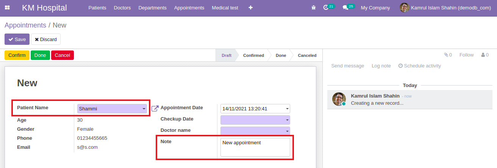

### On change function

- If we choose a patient name while creating a new appointment, it will automatically fill the `Note` field and if we remove the patient it will be empty. This task is done using `onChange` function.

  ```py
  @api.onchange('patient_id')
    def _change_appointment_note(self):
        if self.patient_id:
            if not self.note:
                self.note = "New appointment"
        else:
            self.note = ""
  ```

  

  - [Check out the code for onChange](https://github.com/KamrulSh/km_hospital/commit/6673e3f8f3d9791ad18064dd6cdb37f10336afdb)
