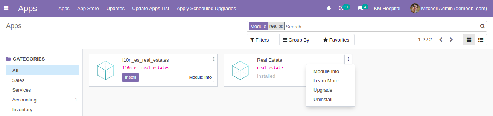
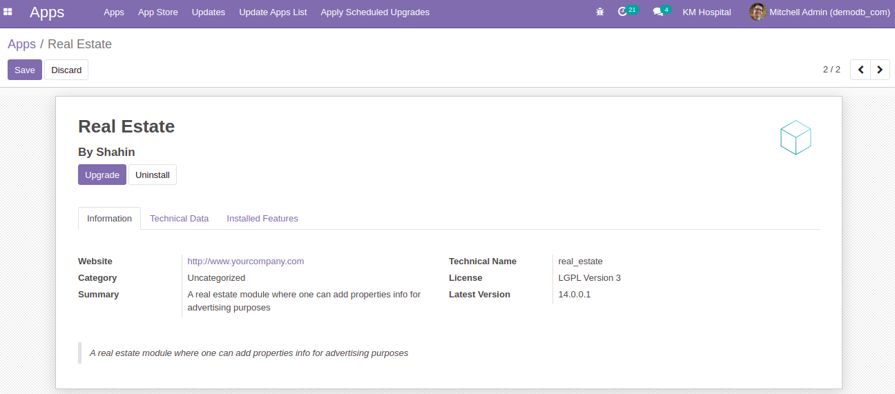
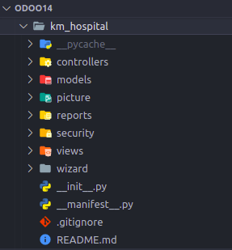
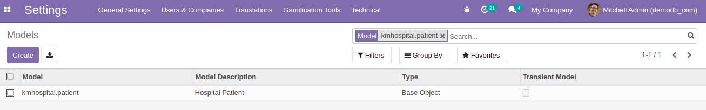
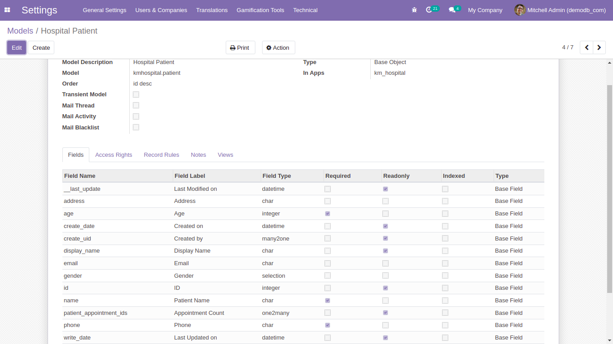

## Creating custom Module

- In the `custom_addons` directory create your own module ex.`real_estate`, `km_hospital` etc. known as technical name. In the module minimum two file is mandatory, one is `__init__.py` and the other is `__manifest__.py`.

- A demo template for `__manifest__.py`:

  ```py
  {
      'name': "Real Estate",
      'sequence': 10,
      'summary': """
          A real estate module where one can add properties info
          for advertising purposes""",

      'description': """
          A real estate module where one can add properties info
          for advertising purposes""",

      'author': "Kamrul",
      'website': "http://www.yourcompany.com",
      'category': 'Uncategorized',
      'version': '0.1',
      'license': 'LGPL-3',
      'depends': ['base'],
      'data': [],
      'demo': [],
      'installable' : True,
      'application' : True,
      'auto_install' : False,
  }
  ```

  Look up the code and try to implement:

  - [Real Estate `__manifest__.py`](https://github.com/KamrulSh/real_estate/blob/main/__manifest__.py)
  - [KM Hospital `__manifest__.py`](https://github.com/KamrulSh/km_hospital/blob/main/__manifest__.py)

- Run the odoo server using this command:
  ```sh
  /opt/odoo/odoo14/./odoo-bin --addons-path=/opt/odoo/odoo14/addons,/opt/odoo/odoo14/custom_addons --xmlrpc-port=8014
  ```
- In the odoo app list search module name `km_hospital` and you will find the app. In the `Module Info` you will find all the information given in the `__manifest__.py` file. You can also install and upgrade the app.

  
  

## Directory structure of odoo modules

- Here is the general structure of a module. Ex. `km_hospital`

  

  - `controllers`: contains (.py) files and all the requests are handled from the browsers and pass to server.
  - `models`: contains all the python (.py) files
  - `reports`: contains python and xml file to create and design report.
  - `security`: holds access rights of the models.
  - `views`: contains all the `.xml` files for different views
  - `wizard`: contains python and xml file to create a modal window.
  - `__init__.py`: contains import statements linking to folders and files in the module.
  - `__manifest__.py`: the root of the module that describe essential information about the module.

- [Check Detailed Odoo Module Structure](https://speedysense.com/odoo-module-structure/)

## Creating new models

- For creating a model first create a folder named `models` and import this from outer `__init__.py`.

  ```py
  from . import models
  ```

- In the `models` folder create another `__init__.py` and a python model file named `patient.py` and import that file from the `__init__.py`. All the python model files have to be imported from the `__init__.py`.

  ```py
  from . import patient
  ```

  - [Check the models directory of km_hospital](https://github.com/KamrulSh/km_hospital/tree/main/models)

- Create a base class in `patient.py` and it inherits the odoo `Model` as regular database-persisted models. Here `_name` is the model name that is required to identify the model and a table will be created in the postgresql database with the name `kmhospital_patient`, by replacing `.` to `_`.

  ```py
  from odoo import api, models, fields

  class HospitalPatient(models.Model):
    _name = 'kmhospital.patient'
    _description = 'Hospital Patient'

    name = fields.Char(string='Patient Name', required=True)
    address = fields.Char(string='Address')
    gender = fields.Selection([
        ('male','Male'),
        ('female', 'Female')
    ], default="male")
  ```

- Fields are used to define what the model can store in the database table. Many types of data can be stored - `Integer, Float, Char, Boolean, Text, Selection, Binary, Datetime` etc.

  - [Different types of fields in patient](https://github.com/KamrulSh/km_hospital/blob/69d0f3be27273ec24aaa3cdc3a25f6d84566adbe/models/patient.py#L5-L19)
  - [Different types of fields in realEstate](https://github.com/KamrulSh/real_estate/blob/068eb99fa50b13223c99f850bca524c92abaebf4/models/realEstate.py#L6-L34)

- Restart the server and upgrade the module and then go to `Settings > Technical > Models`. Search using model name and you will get the model. In this model fields will be created based on the `fields` defined in the model and some predefined fields will also be created.

  
  

### Hurrah !!! You have created a new module.

## 🚀 Happy Coding ! 🔥
