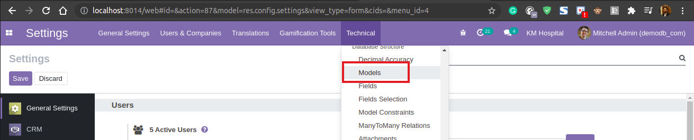
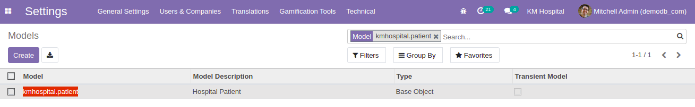
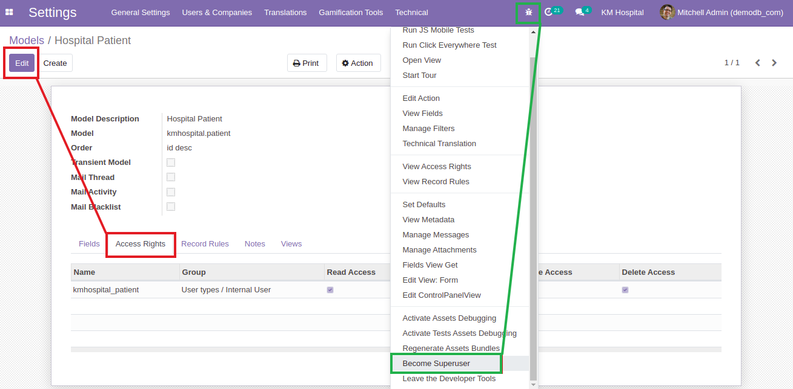
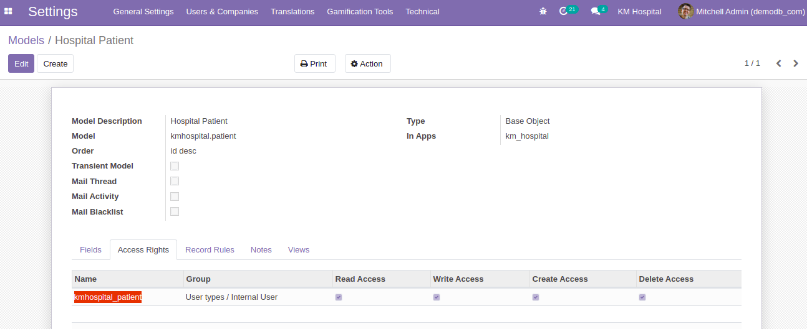

## Set Access Rights (Security) For Newly Created Models

- To give all the permissions for our created models we need to go to the `Technical > Models`.

  

- In the `Models` we have all the models that we have and we have to search our model name `kmhospital.patient` and click this model.

  

- Here we have 3 ways to give access to our models.

  1. From the bug icon select `Become Superuser` and it will bypass all the permissions / access rights for the models. (Green line indication)

     

  2. Go to the `Edit > Access Rights > Add a line` and give a name and select all the access rights. Upgrade the module and you have all the permissions for that model. (Red line indication)

  3. **Best practice:** Create a directory named `security` in `km_hospital` module and create a file named `ir.model.access.csv` and add the below lines in the file.

     ```sh
     id,name,model_id:id,group_id:id,perm_read,perm_write,perm_create,perm_unlink
     access_kmhospital_patient,kmhospital_patient,model_kmhospital_patient,base.group_user,1,1,1,1

     # 1 means True
     # 0 means False
     ```

     Add the file path to the `__manifest__.py` in the `data` list. Upgrade the module and it will automatically add permissions for the model showing in the picture below.

     ```py
     'data': [
        'security/ir.model.access.csv',
        ...
     ],
     ```

     

- [Security Examples for `km_hospital`](https://github.com/KamrulSh/km_hospital/blob/main/security/ir.model.access.csv)

- [Security Examples for `real_estate`](https://github.com/KamrulSh/real_estate/blob/main/security/ir.model.access.csv)

## 🚀 Happy Coding ! 🔥
