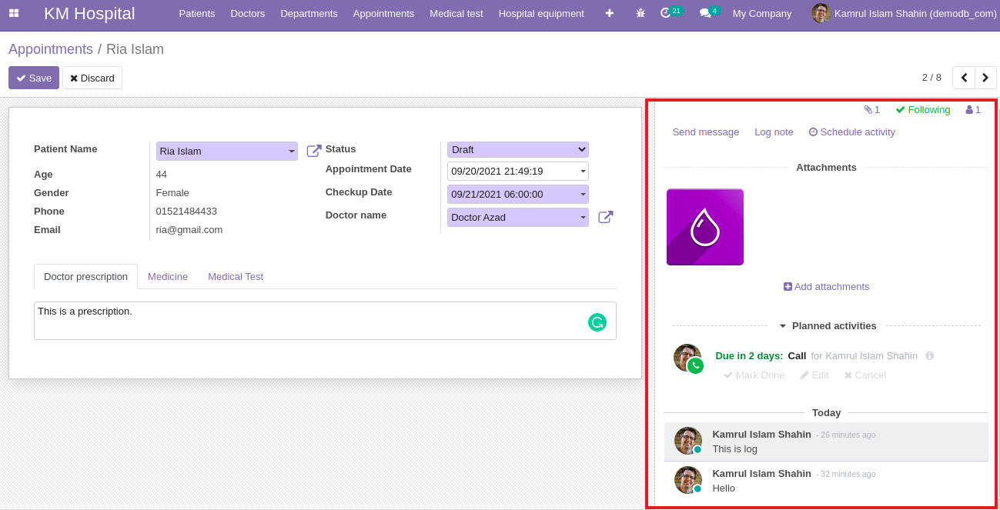
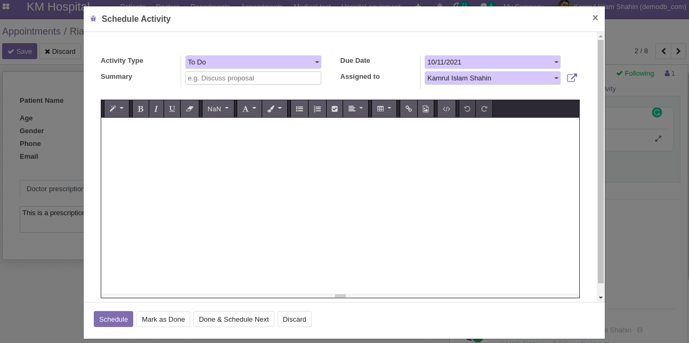
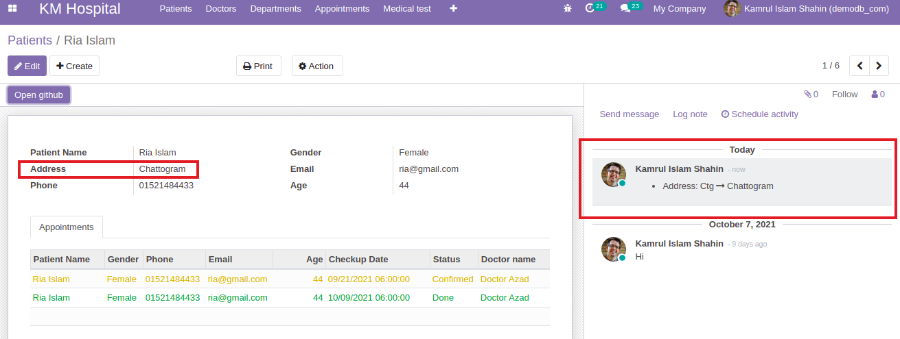

## Send Message, Log and Activity Buttons in form views

- First we have to inherit `mail.thread` and `mail.activity.mixin` module in the specific model inside the class. Here in the `patient.py` file.

  ```py
  _inherit = ['mail.thread', 'mail.activity.mixin']
  ```

- Add inherited module name in the depends in `__manifest__.py`.
  ```py
  'depends': ['mail']
  ```
- Add this code to the `patient_view.xml` inside the `form` tag and after the `sheet` tag. file for viewing chatter options. It will integrate messaging features and activity to the model. It will look like this.

  ```xml
  <div class="oe_chatter">
      <field name="message_follower_ids"/>
      <field name="activity_ids"/>
      <field name="message_ids"/>
  </div>
  ```

  

- In the `Schedule activity` we can schedule based on different activities like Todo, Call etc. Explore this by your own.

  

- Check this code examples

  - [`__manifest__.py`](https://github.com/KamrulSh/km_hospital/blob/c99fb6978e3763f16845ba5657582f9c6d7a5eae/__manifest__.py#L19)
  - [`patient.py`](https://github.com/KamrulSh/km_hospital/blob/c99fb6978e3763f16845ba5657582f9c6d7a5eae/models/patient.py#L10)
  - [`patient_view.xml`](https://github.com/KamrulSh/km_hospital/blob/c99fb6978e3763f16845ba5657582f9c6d7a5eae/views/patient_view.xml#L47-L51)

- Task
  - Try to add chatter in `doctor` and `appointment` model.

## Track field value changes and log in chatter

- For tracking field value changes we have to add an attribute named `tracking=True` in that field in `.py` file. Example:

  ```py
  name = fields.Char(string='Patient Name', required=True, tracking=True)
  ```

  And it will save a log in the chatter and also who have changed the value. Try to add tracking in other fields in `doctor.py`, `patient.py` and `appointment.py` file.

  

## 🚀 Happy Coding ! 🔥
