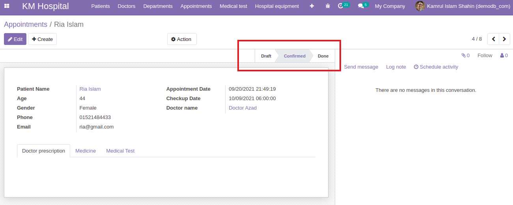
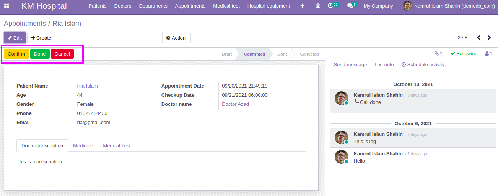
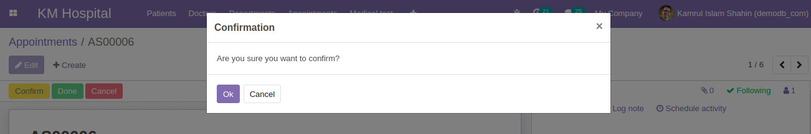

## Adding Status and Status Bar

- For creating a status bar we have to create a selection field in python file. Here, a selection field `status` is created in `appointment.py` file.

  ```py
  status = fields.Selection([
        ('draft', 'Draft'),
        ('confirmed', 'Confirmed'),
        ('done', 'Done'),
        ('cancel', 'Canceled')
  ], default='draft', required=True)
  ```

- In the `appointment_view.xml`, we have to add a `header` with a field named `status` to show and change the status inside the form view and before the `sheet` tag.

  ```xml
  <header>
      <field name="status" widget="statusbar" statusbar_visible="draft,confirm,done" options="{'clickable':'1'}"/>
  </header>
  ```

  

## Control States and Status bar Using Buttons

- We can also control states by using button. For this purpose we have create buttons for changing the states. Here are some examples that we have to add inside the `header` tag:

  ```xml
  <button id="button_confirm" name="action_status_confirm" string="Confirm" class="btn-warning" type="object"/>
  <button id="button_done" name="action_status_done" string="Done" class="btn-success" type="object"/>
  <button id="button_cancel" name="action_status_cancel" string="Cancel" class="btn-danger" type="object"/>
  ```

- Then we have to create functions for changing the states corresponding to its `name` in the `xml` file. One function is created in the `appointment.py` file. Try to create other functions for `done` and `cancel`.

  ```py
  def action_status_confirm(self):
      self.status = 'confirmed'
  ```

  

- Check this code examples:

  - [`appointment_view.xml`](https://github.com/KamrulSh/km_hospital/blob/63cd09522150edf777c33c5847cfb863472bc296/views/appointment_view.xml#L27-L35)
  - [`appointment.py`](https://github.com/KamrulSh/km_hospital/blob/63cd09522150edf777c33c5847cfb863472bc296/models/appointment.py#L40-L51)

- To show the confirmation message after button press we have to add below code inside the `button`.

  ```py
  confirm="Are you sure you want to confirm?"
  ```

  - [Check out the code](https://github.com/KamrulSh/km_hospital/blob/8296221acb1921b5b255c06ccc42407cde12405a/views/appointment_view.xml#L31)

  

## 🚀 Happy Coding ! 🔥
