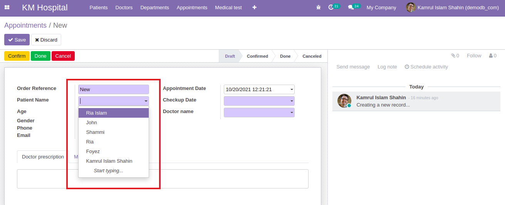
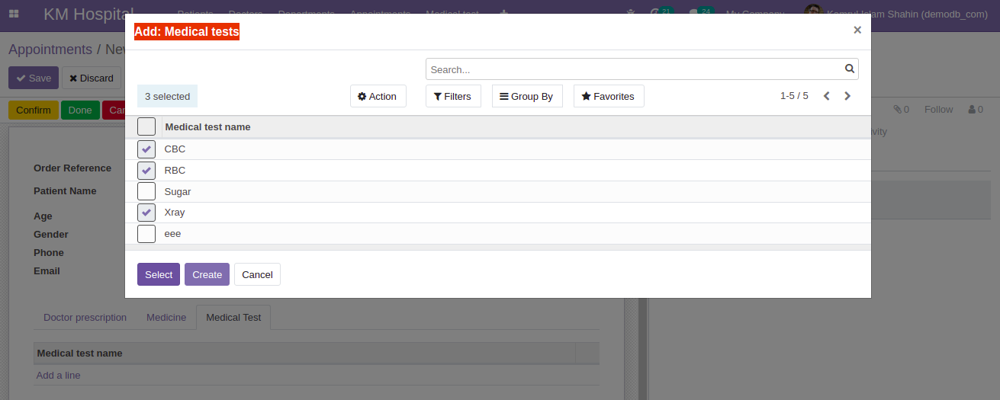
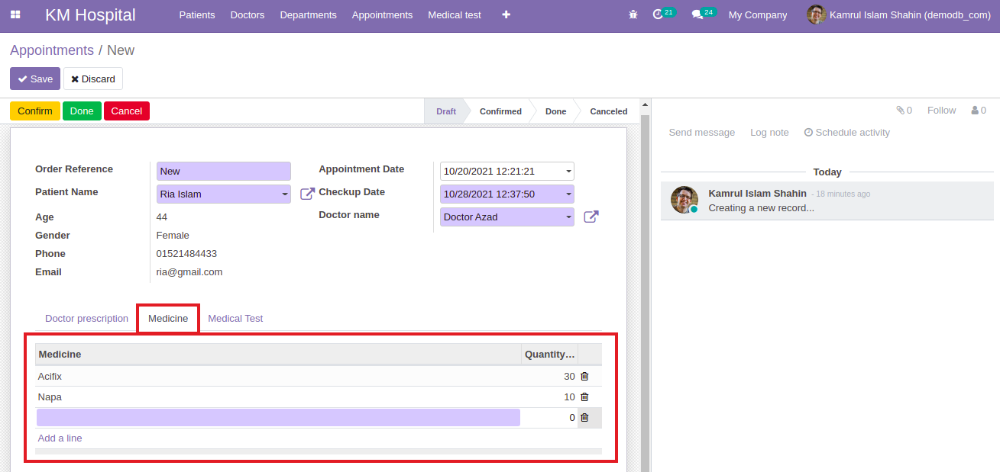

### Relations Between Models

A record from a model may be related to a record from another model. Relational fields link records, either of the same model (hierarchies) or between different models. Here 3 types of Relations are introduced below.

### Many2one

- In our `appointment.py` file, an appointment have a connection to a patient. The value of this field is a record of a model that is associated with `kmhospital.patient`. For this we have to add `Many2one` fields to the models and add them in the views.
- Remember: By convention, `Many2one` fields have the `_id` suffix.

  ```py
  patient_id = fields.Many2one("kmhospital.patient", string='Patient Name', required=True)
  ```

  [Checkout the code snippet](https://github.com/KamrulSh/km_hospital/blob/fbdf54471427ae5531203ebea86aa3d3990f2017/models/appointment.py#L13)

- Add that field to the tree and form view in the `appointment_view.xml`.

  ```xml
  <field name="patient_id"/>
  ```

  [Checkout the code snippet](https://github.com/KamrulSh/km_hospital/blob/fbdf54471427ae5531203ebea86aa3d3990f2017/views/appointment_view.xml#L11)

  

### Many2many

It is bidirectional multiple relationship field, any record on one side can be related to any number of records on the other side.

- In `appointment.py` file, `Many2many` is used to add the multiple medical test. By convention, Many2many fields have the `_ids` suffix.

  ```py
  prescription_medical_test_ids = fields.Many2many("kmhospital.medicaltest", "medical_test_ids", string="Medical tests")
  ```

  [Checkout the code snippet](https://github.com/KamrulSh/km_hospital/blob/fbdf54471427ae5531203ebea86aa3d3990f2017/models/appointment.py#L33-L34)

- We also have to add another `Many2many` field for the medical test in `medicaltest.py`.

  ```py
  medical_test_ids = fields.Many2many(string="Medical tests")
  ```

  [Checkout the code snippet](https://github.com/KamrulSh/km_hospital/blob/fbdf54471427ae5531203ebea86aa3d3990f2017/models/medicaltest.py#L9)

- Add the field in the views file `appointment_view.xml` in tree and from view.

  ```xml
  <field name="prescription_medical_test_ids"/>
  ```

  [Checkout the code snippet](https://github.com/KamrulSh/km_hospital/blob/fbdf54471427ae5531203ebea86aa3d3990f2017/views/appointment_view.xml#L75-L77)

  

### One2many

- In `appointment.py` file, `One2many` is used to store multiple records of medicine. By convention, One2many fields have the `_ids` suffix.

  ```py
  prescription_medicine_ids = fields.One2many("kmhospital.appointment.prescription.medicine", "appointment_medicine_id", string="Prescription Medicine")
  ```

  [Checkout the code snippet](https://github.com/KamrulSh/km_hospital/blob/fbdf54471427ae5531203ebea86aa3d3990f2017/models/appointment.py#L30-L31)

- As One2many is a virtual relationship, there must be a Many2one field in the other model, in our case the model is `kmhospital.appointment.prescription.medicine`, and the field name must be related field like `appointment_medicine_id`.

  ```py
  appointment_medicine_id = fields.Many2one("kmhospital.appointment", string="Appointment medicine")
  ```

  [Checkout the code snippet](https://github.com/KamrulSh/km_hospital/blob/fbdf54471427ae5531203ebea86aa3d3990f2017/models/appointment.py#L63)

- Add the view to the `appointment_view.xml`.

  ```xml
  <field name="prescription_medicine_ids"/>
  ```

- As this field is an editable field we have to change it with tree and from view.

  ```xml
  <field name="prescription_medicine_ids">
      <tree editable="bottom">
          <field name="name"/>
          <field name="quantity"/>
      </tree>
      <form>
          <group>
              <group>
                  <field name="name"/>
              </group>
              <group>
                  <field name="quantity"/>
              </group>
          </group>
      </form>
  </field>
  ```

  [Checkout the code snippet](https://github.com/KamrulSh/km_hospital/blob/fbdf54471427ae5531203ebea86aa3d3990f2017/views/appointment_view.xml#L58-L73)

  

## 🚀 Happy Coding ! 🔥
