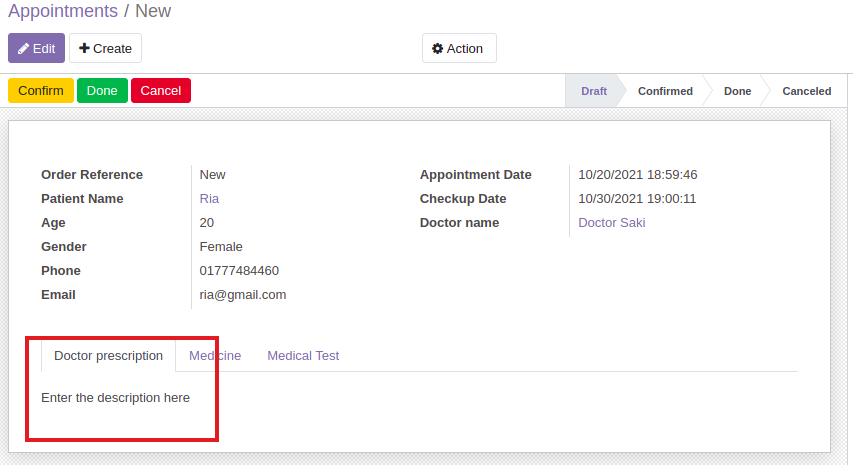
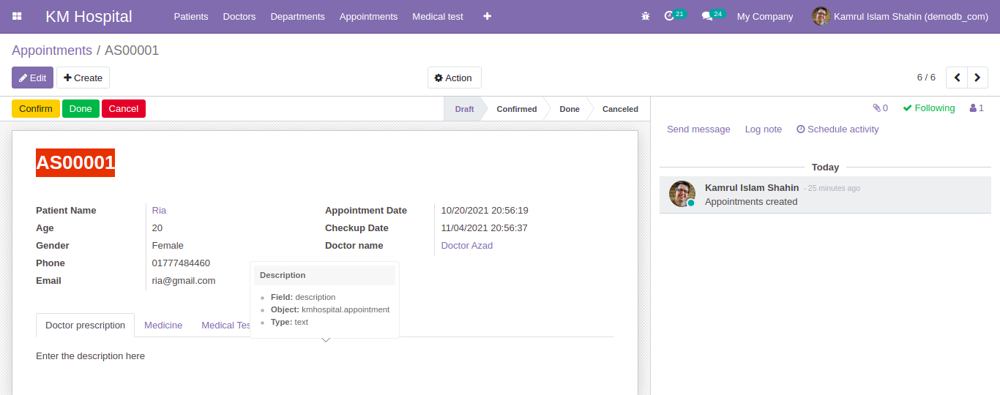

### Override Create Method

- To override the create method we have to add a method named `create` like below. It will override the description field if it is empty.

  ```py
  @api.model
  def create(self, vals):
      if not vals['description']:
          vals['description'] = "Enter the description here"
      res = super(HospitalAppointment, self).create(vals)
      return res
  ```

  

  - [Check out the code](https://github.com/KamrulSh/km_hospital/blob/50f40585124a037396fd0cea26e08710be983740/models/appointment.py#L55-L60)

### Generate Sequential Value For Field

- First we have to create a `data` directory and create a file named `appointment_seq.xml`. Insert the below code for creating a sequence.

  ```xml
  <record id="seq_appointment" model="ir.sequence">
      <field name="name">Appointment Sequence</field>
      <field name="code">kmhospital.appointment</field>
      <field name="prefix">AS</field>
      <field name="padding">5</field>
      <field name="company_id" eval="False"/>
  </record>
  ```

- Check `Settings > Technical > Sequences` if the sequence is created or not.
- Add a field `name` to the `appointment.py` file.

  ```py
  name = fields.Char(string='Appointment Reference', required=True, copy=False, readonly=True, default=lambda self: _('New'))
  ```

- Add this code to the `create` method.

  ```py
  if vals.get('name', _('New')) == _('New'):
      vals['name'] = self.env['ir.sequence'].next_by_code('kmhospital.appointment') or _('New')
  ```

- Add the code in the `appointment_view.xml` file inside the `sheet` tag.

  ```xml
  <div class="oe_title">
      <h1>
          <field name="name"/>
      </h1>
  </div>
  ```

  

  - [Check out the code](https://github.com/KamrulSh/km_hospital/commit/2ed68aa4a565247473c048f01de94ef652518574)

## 🚀 Happy Coding ! 🔥
