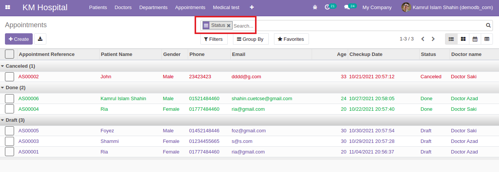
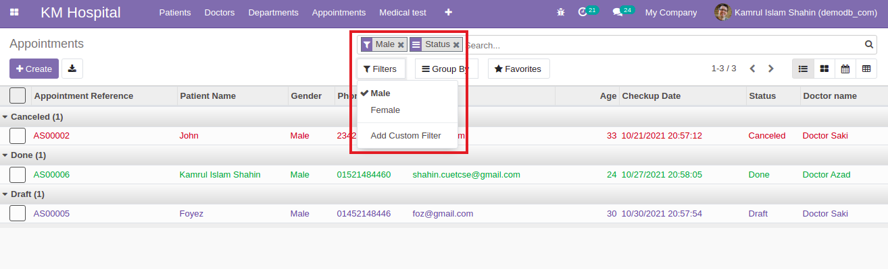
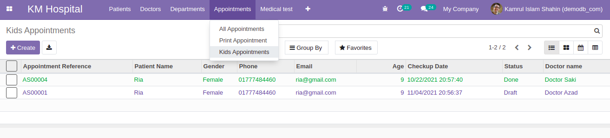
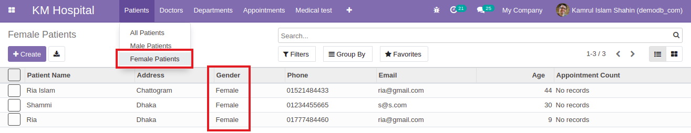
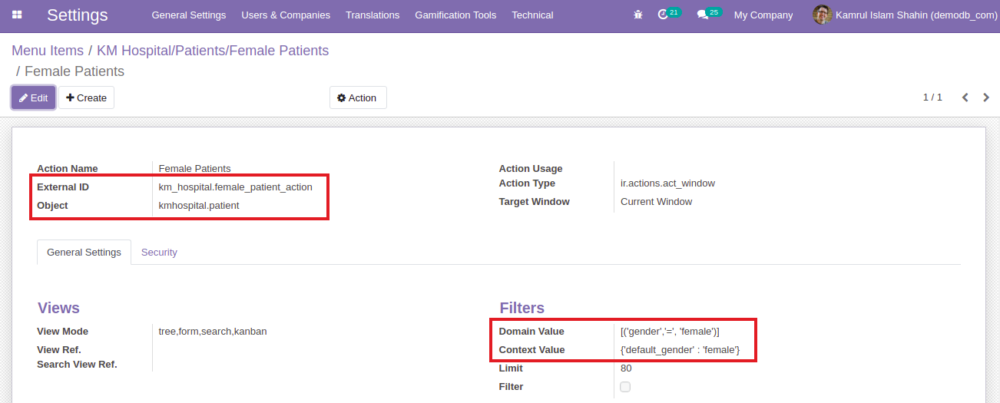
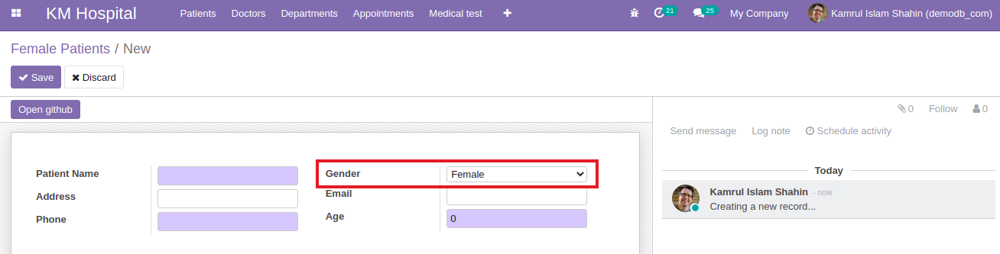
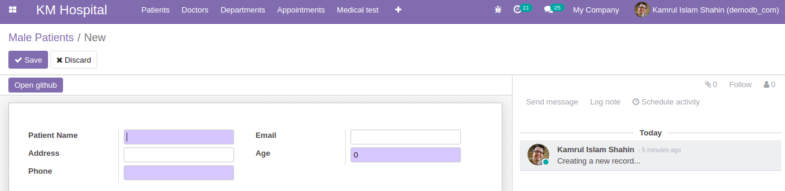

### Set Default GroupBy For Menu Action

- To show the data by group we have to add group rules in search view. Here we have added a group rules by status.

  ```xml
  <group expand="1" string="Group By">
      <filter string="Status" name="state" context="{'group_by':'status'}"/>
  </group>
  ```

- Then we have to add context for this group in action window and add the default search for state inside `{}`. If we don't add the default search then it will be empty.

  ```xml
  <field name="context">{'search_default_state': 1}</field>
  ```

  

  - [Check out the code for group](https://github.com/KamrulSh/km_hospital/blob/b17e37367e679328cded7f15257f9eee753e8b5d/views/appointment_view.xml#L108-L110)

### Set Default Filter For Menu

- For filtering based on gender we have to add some filter rules.

  ```xml
  <filter string="Male" name="male" domain="[('gender', '=', 'male')]"/>
  <filter string="Female" name="female" domain="[('gender', '=', 'female')]"/>
  ```

- Then we have to add context for this filter in action window just like group.

  ```xml
  <field name="context">{'search_default_state': 1, 'search_default_male': 1}</field>
  ```

  

  - [Check out the code for filter](https://github.com/KamrulSh/km_hospital/blob/b17e37367e679328cded7f15257f9eee753e8b5d/views/appointment_view.xml#L106-L107)
  - [Check out the code for both group and filter](https://github.com/KamrulSh/km_hospital/commit/2e4d64d3e9c1e7a46ace646eb806b9a36106cc0f)

### Set Domain For Menu Action

- To set domain for menu action we have created a sub-menu named `Kids Appointments` in the `Appointments` menu. Then set a domain for kids based on age.

  ```xml
  <field name="domain">[('age', '&lt;=', 10)]</field>
  ```

  

  - [Check out the code for kids domain](https://github.com/KamrulSh/km_hospital/commit/b17e37367e679328cded7f15257f9eee753e8b5d)

### Default Field Value using Context Based On Menu

- For showing the specific field values based on clicking the menu, we have to set `domain` field in the window action like below. Here we have to use `fieldName`, `condition` and `fieldValue` inside the `()`.

  ```xml
  # for single domain values
  <field name="domain">[('gender','=', 'female')]</field>

  # for multiple domain values
  1. OR operation
  <field name="domain">['|', ('gender','=', 'female'), ('age', '&lt;=', 10)]</field>
  2. AND operation
  <field name="domain">[('gender','=', 'female'), ('age', '&gt;=', 10)]</field>
  ```

  

- To set the default value for a field we have set the `context` field in the window action like below. Here we have to use `default_fieldName : fieldValue` inside `{}`. Here we will set the default value of `gender` to `male` if we create male patients and `female` otherwise.

  ```xml
  # for male
  <field name="context">{'default_gender' : 'male'}</field>

  # for female
  <field name="context">{'default_gender' : 'female'}</field>
  ```

  
  

  - [Check out the code for male patients](https://github.com/KamrulSh/km_hospital/blob/e176c9741b0181b93bdf626216c0fdcdc11ea09a/views/patient_view.xml#L124-L125)
  - [Check out the code for female patients](https://github.com/KamrulSh/km_hospital/blob/e176c9741b0181b93bdf626216c0fdcdc11ea09a/views/patient_view.xml#L138-L139)

### Hide Fields Based On Context value

- To hide the gender field after clicking the `Patients` sub-menu `Male Patients` or `Female patients` we have to use a context in the action window. And we have to add another attribute named `invisible` in the specific field of the form view.

  ```xml
  # window action
  <field name="context">{'default_gender' : 'female', 'hide_gender' : 1}</field>
  ```

  ```xml
  # form view
  <field name="gender" invisible="context.get('hide_gender')"/>
  ```

  

  - [Check out the code](https://github.com/KamrulSh/km_hospital/commit/bf61e8026eec3bdc740a98ee701c223385ee42c2)

## 🚀 Happy Coding ! 🔥
